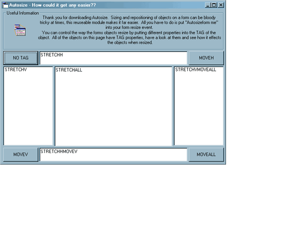



## Autosize \- Resize and Reposition your objects on form resize easily \*\*Updated 2nd October 2001\*\*

### Description

I have added some new TAG properties to the previous version so it is even more versatile, check the screenshot out. The TAGs are as follows. STRETCHH - STRETHCHES HORIZONTALY, STRETCHV - STRETCHES VERTICALY, STRETCHALL - STRETCHES BOTH HORIZONTALY AND VERTICALY, MOVEH - MOVES THE OBJECT HORIZONTALY, MOVEV - MOVES THE OBJECT VERTICALY, MOVEALL - MOVES THE OBJECT BOTH HORIZONTALY AND VERTICALY, **NEW** STRETCHVMOVEH - STRETCHES VERTICALY AND MOVES THE OBJECT HORIZONTALLY, **NEW** STRETCHHMOVEV - STRETCHES HORIZONTALLY AND MOVES THE OBJECT VERTICALY. To use this module simply pick a tag and apply it to an object, then put "Autosizeform me" into the form resize event. This has got to be the best way to keep the layout of your application. All the code is documented, though it is very very easy to use and a must to download if you want to make full applications with resizable forms and not just dialog boxes. Vote for it also please!!!
 
### More Info
 

             |
---                |---
**Submitted On**   |2001-10-02 13:56:58
**By**             |[Niknak\!\!](https://github.com/Planet-Source-Code/PSCIndex/blob/master/ByAuthor/niknak.md)
**Level**          |Advanced
**User Rating**    |4.8 (120 globes from 25 users)
**Compatibility**  |VB 6\.0
**Category**       |[Complete Applications](https://github.com/Planet-Source-Code/PSCIndex/blob/master/ByCategory/complete-applications__1-27.md)
**World**          |[Visual Basic](https://github.com/Planet-Source-Code/PSCIndex/blob/master/ByWorld/visual-basic.md)
**Archive File**   |[Autosize \-273631022001\.zip](https://github.com/Planet-Source-Code/niknak-autosize-resize-and-reposition-your-objects-on-form-resize-easily-updated-2nd-octob__1-27698/archive/master.zip)

